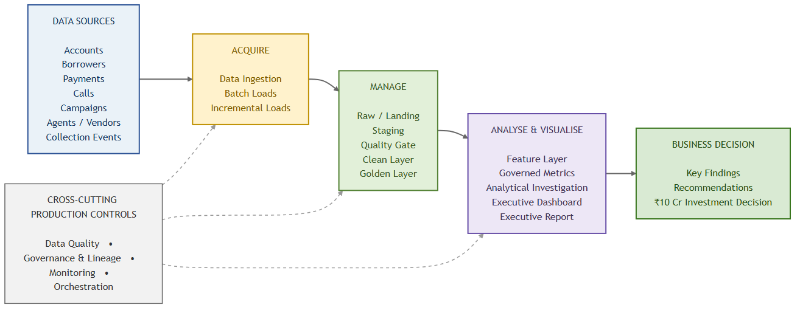

# CredResolve Data Analyst Assignment

## Executive Summary

This repository contains a full-stack data investigation of a collections and recovery portfolio.

The analysis converts operational collections data into a validated, account-centric analytical layer and uses that layer to evaluate recovery performance, payment attribution, portfolio drivers, contact effectiveness, counterfactual comparisons, the reported 11% improvement claim, and a proposed ₹10 crore investment.

The central analytical principle is:

> **Raw operational data should not directly drive business decisions.**

The project therefore follows a controlled workflow:

**Raw Data → Ingestion → Data Quality → Clean Layer → Golden Layer → Governed Metrics → Analytics → Executive Reporting → Business Decision**

The analysis estimates an observed portfolio recovery rate of approximately **12.54%**.

The reported **11% improvement could not be independently verified** because the available data does not provide sufficient historical eligible balances, comparable cohorts, attribution timing, and portfolio controls required to establish a valid mix-adjusted or causal improvement.

An answered-call cohort shows an observed **+0.76 percentage-point payment-rate difference** compared with accounts without answered calls. This is treated as an observational association, **not a causal treatment effect**.

The recommended ₹10 crore investment is therefore **not approved for unconditional full-scale deployment**. The recommended approach is a controlled pilot with treatment and holdout groups, predefined attribution rules, measurable eligible balances, and a break-even-based scaling decision.

---

# Deliverables Index

## 1. Executive & Business Outputs

| Deliverable | Description |
|---|---|
| [Executive Dashboard](reports/executive_dashboard.pdf) | Executive-level portfolio and recovery summary |
| [Executive Memo](reports/executive_memo.pdf) | Business recommendation and investment decision |
| [Investment Analysis](reports/investment_analysis_findings.md) | ₹10 crore investment scenarios, ROI and break-even analysis |
| [Investment Recommendation](reports/investment_recommendation.csv) | Structured investment recommendation |

---

## 2. Data Quality & Analytical Foundation

| Deliverable | Description |
|---|---|
| [Data Quality Report](reports/data_quality_report.md) | Data-quality investigation, validation and limitations |
| [Golden Layer Decisions](reports/golden_layer_decisions.md) | Analytical entity and attribution decisions |
| [Golden Layer Summary](reports/golden_layer_summary.csv) | Golden-layer table inventory |
| [Validation Results](reports/final_cleaned_layer_validation.csv) | Final analytical-layer validation results |
| [Cleaning Decisions](reports/cleaning_decisions.md) | Documented cleaning rules |

The final cleaned analytical layer passed:

**49 / 49 validation checks**

---

## 3. Recovery & Portfolio Analysis

| Deliverable | Description |
|---|---|
| [Recovery Summary](reports/recovery_summary.csv) | Portfolio-level recovery metrics |
| [Recovery by Risk](reports/recovery_by_risk.csv) | Recovery performance by risk segment |
| [Recovery by DPD](reports/recovery_by_dpd.csv) | Recovery performance by delinquency band |
| [Recovery by Status](reports/recovery_by_account_status.csv) | Recovery performance by account status |
| [Recovery by Loan Type](reports/recovery_by_loan_type.csv) | Recovery performance by loan type |
| [Recovery Findings](reports/recovery_findings.md) | Interpretation of portfolio recovery results |
| [Recovery Funnel](reports/recovery_funnel.csv) | Contact-to-payment funnel |

---

## 4. Driver & Operational Analysis

The project evaluates multiple potential performance drivers:

- Risk segment
- DPD band
- Account status
- Loan type
- Agent performance
- Agent tenure
- Campaign
- Channel
- Vendor
- Calling time
- Attempt frequency
- Borrower relationship quality

| Deliverable | Description |
|---|---|
| [Driver Summary](reports/driver_summary.csv) | Highest and lowest observed segment performance |
| [Driver Analysis](reports/driver_analysis.csv) | Consolidated driver-level results |
| [Driver Findings](reports/driver_analysis_findings.md) | Interpretation and limitations |
| [Campaign Performance](reports/campaign_performance.csv) | Campaign-level contact performance |
| [Campaign Recovery Performance](reports/campaign_recovery_performance.csv) | Campaign-level recovery outcomes |

Driver differences are treated as **descriptive evidence and hypotheses for controlled testing**, not automatically as causal effects.

---

# Key Findings Snapshot

### Portfolio

- **Accounts:** 30,000
- **Outstanding amount:** ₹10.489 Cr approximately
- **Successful recovered amount:** ₹13.156 Cr approximately
- **Observed recovery rate:** 12.54%
- **Successful payments:** 17,534
- **Calls:** 90,079
- **Answered calls:** 17,896
- **Promises to pay:** 18,000
- **Kept promises:** 4,489
- **Field visits:** 25,000
- **SMS events:** 45,000
- **WhatsApp events:** 60,000

### Recovery Performance

- The strongest observed DPD recovery rate is the **31–60 DPD** band at approximately **13.20%**.
- The lowest observed DPD recovery rate is the **1–30 DPD** band at approximately **12.30%**.
- The highest observed risk-segment recovery rate is **MEDIUM** at approximately **12.58%**.
- The lowest observed risk-segment recovery rate is **NPA** at approximately **12.50%**.
- **CONSUMER** loans have the highest observed recovery rate among the analyzed loan types at approximately **12.88%**.
- **PERSONAL** loans have the lowest observed recovery rate at approximately **12.25%**.

### Contact & Payment

- **13,535 accounts** had at least one answered call.
- **16,465 accounts** had no answered call.
- Answered-call accounts had an observed payment-account rate of approximately **44.70%**.
- Accounts without answered calls had an observed payment-account rate of approximately **43.94%**.
- Observed difference: **+0.76 percentage points**.

This difference is **not interpreted as incremental recovery caused by calling** because treatment assignment was operational rather than randomized.

---

# 11% Improvement Assessment

The reported **11% improvement remains UNVERIFIED**.

The current data supports:

- descriptive recovery analysis
- segment-level comparison
- monthly performance analysis
- portfolio composition analysis
- observational treatment/comparison analysis

However, the available data does not support a defensible causal or mix-adjusted 11% improvement claim.

A stronger verification would require:

1. Historical eligible outstanding balances
2. Comparable before/after cohorts
3. DPD composition
4. Risk composition
5. Account-status composition
6. Loan-type composition
7. Campaign composition
8. Channel composition
9. Contact selection
10. Defined payment attribution windows

Therefore:

> **The project does not present the 11% improvement as a proven business outcome.**

This is a deliberate analytical conclusion rather than a limitation hidden from the decision-maker.

---

# Counterfactual Analysis

The project compares:

**Treatment:** accounts with at least one answered call

**Comparison:** accounts without an answered call

The comparison is restricted across common strata using:

- DPD band
- Risk segment
- Account status
- Loan type

### Observed Result

| Measure | Result |
|---|---:|
| Treatment accounts | 13,535 |
| Comparison accounts | 16,465 |
| Treatment payment rate | 44.70% |
| Comparison payment rate | 43.94% |
| Observed difference | +0.76 pp |
| Matched strata | 400 |

The result is an **observational association**.

It is not a causal treatment effect because answered calls were not randomly assigned.

Potential selection factors include:

- collection priority
- contactability
- agent allocation
- campaign exposure
- timing
- account characteristics

[Read the full Counterfactual Analysis](reports/counterfactual_analysis_findings.md)

---

# ₹10 Crore Investment Decision

The proposed ₹10 crore investment is evaluated using downside, base and upside scenarios.

The observed answered-call difference is used only as a scenario assumption and **not as a proven causal uplift**.

### Investment Scenarios

| Scenario | Incremental Rate | Incremental Recovery | ROI |
|---|---:|---:|---:|
| Downside | 0.38% | ₹61.96 lakh | -93.80% |
| Base | 0.76% | ₹1.24 Cr | -87.61% |
| Upside | 1.52% | ₹2.48 Cr | -75.21% |

### Break-Even

The investment requires approximately:

**1,010 additional paying accounts**

This corresponds to approximately:

**6.13% of currently non-answered accounts**

### Decision

> **Do not deploy the full ₹10 crore immediately.**

Instead:

**Run a controlled pilot → maintain a holdout group → measure incremental recovery → compare against break-even → scale only if the evidence supports it.**

[Read the full Investment Analysis](reports/investment_analysis_findings.md)

---

# Production Analytics Architecture

The project follows a production-oriented analytical architecture.



### Core Flow

```text
DATA SOURCES
     │
     ▼
ACQUIRE
     │
     ▼
MANAGE
     │
     ├── Raw / Landing
     ├── Staging
     ├── Quality Gate
     ├── Clean Layer
     └── Golden Layer
     │
     ▼
ANALYSE & VISUALISE
     │
     ├── Feature Layer
     ├── Governed Metrics
     ├── Analytical Investigation
     ├── Executive Dashboard
     └── Executive Report
     │
     ▼
BUSINESS DECISION
     │
     ├── Key Findings
     ├── Recommendations
     └── ₹10 Cr Investment Decision
```

Cross-cutting controls include:

- Data quality
- Governance
- Lineage
- Monitoring
- Orchestration

[Architecture Documentation](docs/production_architecture.md)

[Mermaid Architecture Source](docs/production_architecture.mmd)

---

# Analytical Entity & Data Model

## Canonical Analytical Entity

`account_id` is the canonical analytical entity for recovery analysis.

This prevents inconsistent borrower-level relationships from changing account-level recovery attribution.

## Payment Attribution

The accepted attribution path is:

```text
payment_id → account_id
```

Successful payments with valid `account_id` remain available for recovery analysis.

`borrower_id` is retained as a secondary relationship attribute.

## Borrower Identity

Borrower identity contains substantial quality issues.

The project therefore:

- retains explicit quality indicators
- does not silently reassign unresolved relationships
- does not fabricate identifiers
- does not use borrower identity as the primary recovery key

## Duplicate Handling

The cleaning process distinguishes between:

### Unambiguous duplicates

These can be safely removed when the duplicate relationship is clear.

### Non-exact or conflicting records

These are retained with quality information when deletion could alter analytical interpretation.

---

# Data Quality

The final analytical layer passed:

```text
49 / 49 validation checks
0 failed
```

Validation covers areas including:

- row-count integrity
- duplicate handling
- identifier integrity
- account relationships
- quality flags
- temporal consistency
- analytical-layer structure

A validation pass does **not** mean the source data contains no issues.

It means the documented analytical rules were satisfied by the final analytical layer.

[Read the Data Quality Report](reports/data_quality_report.md)

---

# SQL Repository

The project includes a DuckDB-based analytical SQL repository.

```text
sql/
└── credresolve_analysis.sql
```

The repository defines analytical views over the Golden layer and contains queries for:

- portfolio recovery
- risk analysis
- DPD analysis
- account status
- loan type
- campaign
- channel
- payment attribution
- operational performance
- analytical metrics

The SQL repository was successfully executed using DuckDB.

---

# Analysis Notebook

The project includes a reproducible Jupyter analysis notebook.

```text
notebooks/
├── credresolve_analysis.ipynb
└── credresolve_analysis_executed.ipynb
```

The executed notebook contains the generated analytical outputs and provides a reproducible record of the investigation.

---

# Technology Stack

| Area | Technology |
|---|---|
| Programming | Python |
| Data Processing | Pandas |
| Analytical SQL | DuckDB |
| Notebook | Jupyter |
| Visualization | Matplotlib |
| PDF Reporting | ReportLab |
| Architecture | Mermaid |
| Documentation | Markdown |
| Version Control | Git / GitHub |

---

# Project Structure

```text
CredResolve_Data_Analyst/
│
│
├── docs/
│   ├── production_architecture.md
│   └── production_architecture.mmd
│
├── notebooks/
│   ├── credresolve_analysis.ipynb
│   └── credresolve_analysis_executed.ipynb
│
├── reports/
│   ├── executive_dashboard.pdf
│   ├── executive_memo.pdf
│   ├── production_architecture.pdf
│   ├── final_report.pdf
│   ├── data_quality_report.md
│   ├── golden_layer_decisions.md
│   ├── recovery_findings.md
│   ├── driver_analysis_findings.md
│   ├── counterfactual_analysis_findings.md
│   ├── improvement_verification_findings.md
│   ├── investment_analysis_findings.md
│   └── analytical CSV outputs
│
├── sql/
│   └── credresolve_analysis.sql
│
├── src/
│   ├── account_borrower_identity_analysis.py
│   ├── account_borrower_relationship_analysis.py
│   ├── add_borrower_quality_flags.py
│   ├── add_call_quality_flags.py
│   ├── add_missing_identifier_flags.py
│   ├── agent_identity_analysis.py
│   ├── architecture_document.py
│   ├── borrower_identity_analysis.py
│   ├── borrower_identity_conflict_summary.py
│   ├── borrower_identity_resolution.py
│   ├── build_analysis_notebook.py
│   ├── build_golden_layer.py
│   ├── clean_borrowers.py
│   ├── clean_calls.py
│   ├── clean_payments.py
│   ├── cleaning_pipeline.py
│   ├── counterfactual_analysis.py
│   ├── deduplicate_exact_events.py
│   ├── driver_analysis.py
│   ├── executive_dashboard.py
│   ├── executive_memo.py
│   ├── final_cleaned_layer_validation.py
│   ├── final_recovery_analysis.py
│   ├── forensic_analysis.py
│   ├── improvement_verification.py
│   ├── investment_analysis.py
│   ├── metric_definition_analysis.py
│   ├── monthly_performance_analysis.py
│   ├── payment_attribution_analysis.py
│   ├── performance_change_analysis.py
│   ├── recovery_analysis.py
│   ├── recovery_funnel_analysis.py
│   ├── statistical_investigation.py
│   ├── update_cleaning_decisions.py
│   ├── validate_cleaned_layer.py
│   └── validate_whatsapp_clean.py
│
├── .gitattributes
├── .gitignore
├── requirements.txt
└── README.md
```

---

# How to Run

## 1. Clone the Repository

```bash
git clone https://github.com/Bharadwaj1433/CredResolve_Data_Analyst_Assignment.git
cd CredResolve_Data_Analyst_Assignment
```

## 2. Create Virtual Environment

### Windows PowerShell

```powershell
python -m venv .venv
.\.venv\Scripts\Activate.ps1
```

## 3. Install Dependencies

```powershell
pip install -r requirements.txt
```

## 4. Run Validation

```powershell
python src\final_cleaned_layer_validation.py
```

## 5. Build Golden Layer

```powershell
python src\build_golden_layer.py
```

## 6. Run Analytical Modules

Examples:

```powershell
python src\metric_definition_analysis.py
python src\monthly_performance_analysis.py
python src\performance_change_analysis.py
python src\driver_analysis.py
python src\statistical_investigation.py
python src\forensic_analysis.py
python src\counterfactual_analysis.py
python src\improvement_verification.py
python src\investment_analysis.py
```

## 7. Execute SQL Repository

```powershell
python -c "import duckdb; con=duckdb.connect(); con.execute(open('sql/credresolve_analysis.sql',encoding='utf-8').read()); print('SQL repository: PASS')"
```

## 8. Execute Notebook

```powershell
jupyter nbconvert --to notebook --execute notebooks\credresolve_analysis.ipynb --output credresolve_analysis_executed.ipynb --output-dir notebooks
```

## 9. Generate Executive Outputs

```powershell
python src\executive_dashboard.py
python src\executive_memo.py
```

---

# Data Availability

The underlying operational datasets are **not published in this repository**.

The following data directories are excluded through `.gitignore`:

```text
data/raw/
data/staging/
data/clean/
data/cleaned/
data/golden/
```

The repository therefore contains the analytical code, SQL, documentation, notebooks, derived reports, and executive outputs without publishing the underlying operational data.

---

# Analytical Limitations

The following limitations materially affect interpretation:

1. The reported 11% improvement cannot be independently verified.
2. Historical eligible outstanding balances are unavailable.
3. Answered-call treatment assignment was operational rather than randomized.
4. The +0.76 percentage-point payment-rate difference is observational.
5. Borrower identity contains significant conflicts.
6. Calling-time analysis contains multiple timezones.
7. Portfolio composition can influence observed recovery differences.
8. Campaign, channel, agent, and vendor comparisons may contain selection effects.
9. Historical cohort comparability is insufficient for a causal improvement claim.
10. The investment scenarios are decision-support assumptions rather than guaranteed forecasts.

---

# Final Business Recommendation

The evidence supports a **controlled collections optimization pilot**, not an unconditional ₹10 crore rollout.

The pilot should include:

- randomized or strongly controlled treatment assignment
- predefined holdout group
- clearly defined eligible balance
- predefined payment attribution window
- channel allocation rules
- agent allocation controls
- portfolio-mix monitoring
- incremental recovery measurement
- break-even threshold
- predefined scale / no-scale decision criteria

The investment should only be scaled if the measured incremental recovery exceeds the required break-even threshold after controlling for relevant portfolio and operational factors.

---

# Conclusion

This project demonstrates an end-to-end data analyst workflow:

```text
Operational Data
      ↓
Data Profiling
      ↓
Data Quality Investigation
      ↓
Cleaning & Deduplication
      ↓
Validation
      ↓
Golden Analytical Layer
      ↓
Metric Definition
      ↓
Recovery Analysis
      ↓
Driver Analysis
      ↓
Statistical Investigation
      ↓
Counterfactual Analysis
      ↓
Improvement Verification
      ↓
Investment Analysis
      ↓
Executive Decision
```

The key conclusion is not that the reported 11% improvement is false.

The defensible conclusion is:

> **The available evidence is insufficient to validate the reported 11% improvement as a causal or mix-adjusted recovery improvement.**

That distinction is fundamental to the analytical integrity of the project.
